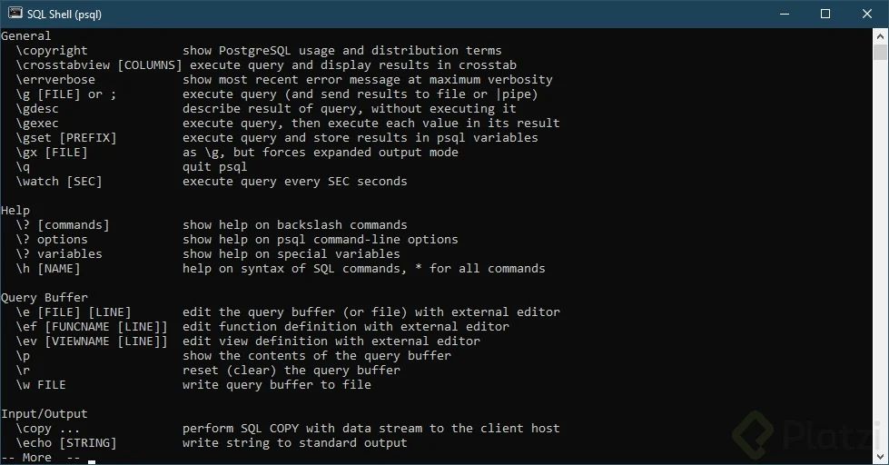
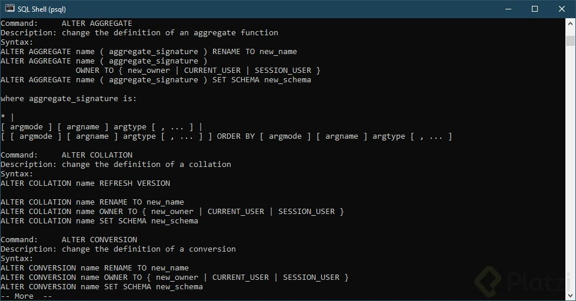

La Consola

La consola en PostgreSQL es una herramienta muy potente para crear, administrar y depurar nuestra base de datos. podemos acceder a ella después de instalar PostgreSQL y haber seleccionado la opción de instalar la consola junto a la base de datos.

PostgreSQL está más estrechamente acoplado al entorno UNIX que algunos otros sistemas de bases de datos, utiliza las cuentas de usuario nativas para determinar quién se conecta a ella (de forma predeterminada). El programa que se ejecuta en la consola y que permite ejecutar consultas y comandos se llama psql, psql es la terminal interactiva para trabajar con PostgreSQL, es la interfaz de línea de comando o consola principal, así como PgAdmin es la interfaz gráfica de usuario principal de PostgreSQL.

Después de emitir un comando PostgreSQL, recibirás comentarios del servidor indicándote el resultado de un comando o mostrándote los resultados de una solicitud de información. Por ejemplo, si deseas saber qué versión de PostgreSQL estás usando actualmente, puedes hacer lo siguiente:

Comandos de ayuda

En consola los dos principales comandos con los que podemos revisar el todos los comandos y consultas son:

    \? Con el cual podemos ver la lista de todos los comandos disponibles en consola, comandos que empiezan con backslash ()

    \h Con este comando veremos la información de todas las consultas SQL disponibles en consola. Sirve también para buscar ayuda sobre una consulta específica, para buscar información sobre una consulta específica basta con escribir \h seguido del inicio de la consulta de la que se requiera ayuda, así: \h ALTER

De esta forma podemos ver toda la ayuda con respecto a la consulta ALTER

Comandos de navegación y consulta de información

    \c Saltar entre bases de datos

    \l Listar base de datos disponibles

    \dt Listar las tablas de la base de datos

    \d <nombre_tabla> Describir una tabla

    \dn Listar los esquemas de la base de datos actual

    \df Listar las funciones disponibles de la base de datos actual

    \dv Listar las vistas de la base de datos actual

    \du Listar los usuarios y sus roles de la base de datos actual

Comandos de inspección y ejecución

    \g Volver a ejecutar el comando ejecutando justo antes

    \s Ver el historial de comandos ejecutados

    \s <nombre_archivo> Si se quiere guardar la lista de comandos ejecutados en un archivo de texto plano

    \i <nombre_archivo> Ejecutar los comandos desde un archivo

    \e Permite abrir un editor de texto plano, escribir comandos y ejecutar en lote. \e abre el editor de texto, escribir allí todos los comandos, luego guardar los cambios y cerrar, al cerrar se ejecutarán todos los comandos guardados.

    \ef Equivalente al comando anterior pero permite editar también funciones en PostgreSQL

Comandos para debug y optimización

    \timing Activar / Desactivar el contador de tiempo por consulta

Comandos para cerrar la consola

    \q Cerrar la consola

Ejecutando consultas en la base de datos usando la consola

De manera predeterminada PostgreSQL no crea bases de datos para usar, debemos crear nuestra base de datos para empezar a trabajar, verás que existe ya una base de datos llamada postgres pero no debe ser usada ya que hace parte del CORE de PostgreSQL y sirve para gestionar las demás bases de datos.

Para crear una base de datos debes ejecutar la consulta de creación de base de datos, es importante entender que existe una costumbre no oficial al momento de escribir consultas; consiste en poner en mayúsculas todas las palabras propias del lenguaje SQL cómo CREATE, SELECT, ALTE, etc y el resto de palabras como los nombres de las tablas, columnas, nombres de usuarios, etc en minúscula. No está claro el porqué de esta especie de “estándar” al escribir consultas SQL pero todo apunta a que en el momento que SQL nace, no existían editores de consultas que resaltaran las palabras propias del lenguaje para diferenciar fácilmente de las palabras que no son parte del lenguaje, por eso el uso de mayúsculas y minúsculas.

Las palabras reservadas de consultas SQL usualmente se escriben en mayúscula, ésto para distinguir entre nombres de objetos y lenguaje SQL propio, no es obligatorio, pero podría serte útil en la creación de Scripts SQL largos.

Vamos ahora por un ligero ejemplo desde la creación de una base de datos, la creación de una tabla, la inserción, borrado, consulta y alteración de datos de la tabla.

Primero crea la base de datos, “CREATE DATABASE transporte;” sería el primer paso.

Ahora saltar de la base de datos postgres que ha sido seleccionada de manera predeterminada a la base de datos transporte recién creada utilizando el comando \c transporte.

Ahora vamos a crear la tabla tren, el SQL correspondiente sería:

CREATE TABLE tren ( id serial NOT NULL, modelo character varying, capacidad integer, CONSTRAINT tren_pkey PRIMARY KEY (id) );

La columna id será un número autoincremental (cada vez que se inserta un registro se aumenta en uno), modelo se refiere a una referencia al tren, capacidad sería la cantidad de pasajeros que puede transportar y al final agregamos la llave primaria que será id.

Ahora que la tabla ha sido creada, podemos ver su definición utilizando el comando \d tren

PostgreSQL ha creado el campo id automáticamente cómo integer con una asociación predeterminada a una secuencia llamada ‘tren_id_seq’. De manera que cada vez que se inserte un valor, id tomará el siguiente valor de la secuencia, vamos a ver la definición de la secuencia. Para ello, \d tren_id_seq es suficiente:

Vemos que la secuencia inicia en uno, así que nuestra primera inserción de datos dejará a la columna id con valor uno.

INSERT INTO tren( modelo, capacidad ) VALUES (‘Volvo 1’, 100);

Consultamos ahora los datos en la tabla:

SELECT * FROM tren;

Vamos a modificar el valor, establecer el tren con id uno que sea modelo Honda 0726. Para ello ejecutamos la consulta tipo UPDATE tren SET modelo = 'Honda 0726' Where id = 1;

Verificamos la modificación SELECT * FROM tren;

Ahora borramos la fila: DELETE FROM tren WHERE id = 1;

Verificamos el borrado SELECT * FROM tren;

El borrado ha funcionado tenemos 0 rows, es decir, no hay filas. Ahora activemos la herramienta que nos permite medir el tiempo que tarda una consulta \timing

Probemos cómo funciona al medición realizando la encriptación de un texto cualquiera usando el algoritmo md5:

